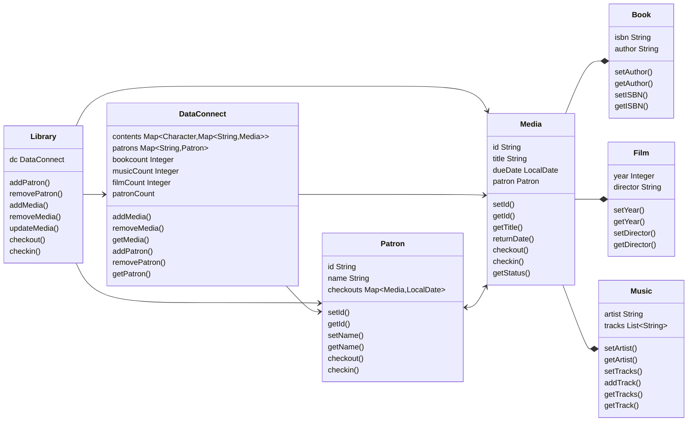

```mermaid
classDiagram
    direction LR
    Library --> Media
    Library --> Patron
    Library --> DataConnect
    DataConnect --> Media
    DataConnect --> Patron
    Patron <--> Media
    Media --* Book
    Media --* Film
    Media --* Music
    
    class Library {
        dc DataConnect
        addPatron()
        removePatron()
        addMedia()
        removeMedia()
        updateMedia()
        checkout()
        checkin()
    }

    class DataConnect {
        contents Map&ltCharacter,Map&ltString,Media&gt&gt
        patrons Map&ltString,Patron&gt
        bookcount Integer
        musicCount Integer
        filmCount Integer
        patronCount
        addMedia()
        removeMedia()
        getMedia()
        addPatron()
        removePatron()
        getPatron()
    }

    class Patron {
        id String
        name String
        checkouts Map&ltMedia,LocalDate&gt
        setId()
        getId()
        setName()
        getName()
        checkout()
        checkin()
    }

    class Media {
        id String
        title String
        dueDate LocalDate
        patron Patron
        setId()
        getId()
        getTitle()
        returnDate()
        checkout()
        checkin()
        getStatus()
    }

    class Book {
        isbn String
        author String
        setAuthor()
        getAuthor()
        setISBN()
        getISBN()
    }

    class Music {
        artist String
        tracks List&ltString&gt
        setArtist()
        getArtist()
        setTracks()
        addTrack()
        getTracks()
        getTrack()
    }

    class Film {
        year Integer
        director String
        setYear()
        getYear()
        setDirector()
        getDirector()
    }
```